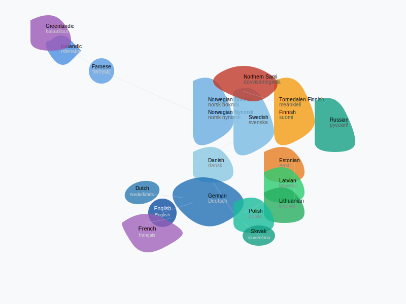

[](https://github.com/jarilammi/lutheran.radio/actions/workflows/codeql-analysis.yml)

# Lutheran Radio

📱 [Available on the App Store](https://apps.apple.com/fi/app/lutheran-radio/id6738301787?l=fi)

Listen to Lutheran Radio on iOS.

## Localizations
<table style="border: none;">
<tr>
<td width="40%" style="border: none;">

The app is fully localized in the following languages:
- Danish (da)
- German (de)
- English (en)
- Estonian (et)
- Finnish (fi)
- Tornedalen Finnish (fit)
- Faroese (fo)
- Icelandic (is)
- Greenlandic (kl)
- Lithuanian (lt)
- Latvian (lv)
- Norwegian Bokmål (nb)
- Norwegian Nynorsk (nn)
- Polish (pl)
- Russian (ru)
- Northern Sami (se)
- Swedish (sv)

</td>
<td width="60%" style="border: none;">



</td>
</tr>
</table>

## Local Development and Contributing

To ensure a smooth development experience, follow these steps before contributing:

1. **Verify Project Build:** Confirm the project builds successfully with: ```xcodebuild -scheme "Lutheran Radio" -sdk iphonesimulator18.5 -destination 'platform=iOS Simulator,OS=18.5,name=iPhone 16 Pro' clean build```
   Ensure the output includes: **```** BUILD SUCCEEDED **```**

2. **Run Test Suite:** Validate the test suite passes with: ```xcodebuild -scheme "Lutheran Radio" -sdk iphonesimulator18.5 -destination 'platform=iOS Simulator,OS=18.5,name=iPhone 16 Pro' clean test```
   Check that the output includes: **```** TEST SUCCEEDED **```**

By verifying these steps on your local machine, you'll help maintain a consistent development environment for the project.

### Troubleshooting

If you encounter build or test issues, try these steps:

1. **Set Xcode Path:** If Xcode commands aren't found, run: ```sudo xcode-select -s /Applications/Xcode.app```
   Verify that your desired iPhone model is available with: ```xcrun simctl list```

2. **Clean Build Folder**: ```xcodebuild clean```

3. **Clean Derived Data**: This removes all derived data for all projects, so use with caution: ```rm -rf ~/Library/Developer/Xcode/DerivedData/*```

After cleaning, retry the build and test steps above.

# Security Implementation

## Certificate Pinning

The app implements certificate pinning to prevent man-in-the-middle (MITM) attacks. Key details:

1. **Domain:** ```lutheran.radio``` (including subdomains)
2. **Pinned Value:** SHA-256 hash of the server’s public key, Base64-encoded
3. **Location:** Embedded in ```Info.plist``` under ```NSAppTransportSecurity > NSPinnedDomains``` (primary) and ```StreamingSessionDelegate.swift``` (backup validation)
4. **Current Hash:** ```mm31qgyBr2aXX8NzxmX/OeKzrUeOtxim4foWmxL4TZY=```

### Certificate Renewal Strategy

To ensure uninterrupted service during SSL certificate renewals, the app includes a strategic transition system:

- **Transition Period:** July 20 - August 20, 2025 (30 days before certificate expiry)
- **User Experience:** During certificate renewal, users see "SSL certificate renewed - update app soon" with continued streaming functionality
- **Security Protection:** Transition support is disabled by default and protected against date manipulation attacks
- **Implementation:** Controlled via shielding variable in `StreamingSessionDelegate.swift` that requires deliberate code changes to enable

This approach prevents service disruption during certificate updates while maintaining security through continued ATS enforcement and time-bounded operation.

### Why SHA-256?

- Strong collision resistance
- Fast verification for frequent connections
- Suitable for public key pinning (not sensitive data)

### Verifying the Certificate Hash

To check or update the pinned hash:

```bash
openssl s_client -connect livestream.lutheran.radio:8443 -servername livestream.lutheran.radio < /dev/null 2>/dev/null \
| openssl x509 -pubkey -noout \
| openssl pkey -pubin -inform pem -outform der \
| openssl dgst -sha256 -binary \
| base64
```

Match the output against the ```SPKI-SHA256-BASE64``` value in ```Info.plist```. Update if necessary.

## Security Model Validation

The app enforces security model validation to ensure only versions with an approved security implementation can stream content. This protects against compromised or obsolete app versions.

1. **Domain:** ```securitymodels.lutheran.radio```
2. **Mechanism:** Queries a DNS TXT record for a comma-separated list of valid security models (e.g., `"mariehamn,visby,landvetter,nuuk"`)
3. **Pinned Value:** Fixed security model string embedded in the app (currently `"nuuk"`)
4. **Location:** Defined in `DirectStreamingPlayer.swift` as `appSecurityModel`
5. **Behavior:** If the app’s security model isn’t in the TXT record, playback is permanently disabled with a user-facing error message

### Why DNS TXT Records?

- **Dynamic Updates:** Allows real-time revocation of compromised models by updating the TXT record, without requiring app updates.
- **Simplicity:** Leverages existing DNS infrastructure for lightweight validation, avoiding the need for a dedicated server.
- **Security:** Complements certificate pinning by linking app functionality to a centrally managed DNS record.

### Verifying the Security Model

To check the current valid security models:

```bash
dig +short TXT securitymodels.lutheran.radio
```

Example output:

```
"mariehamn,visby,landvetter,nuuk"
```

Compare this output to the security model defined in the app (found in ```DirectStreamingPlayer.swift``` as ```appSecurityModel```). If the app’s model (e.g., "nuuk") isn’t listed, it will fail validation. To update the list, modify the TXT record for ```securitymodels.lutheran.radio``` through the DNS management interface for the ```lutheran.radio``` domain.

### Security Model TXT Record Usage

Lutheran Radio's security system uses a DNS TXT record to ensure only trusted app versions can stream content. The longest practical TXT record length for this purpose is about 450 bytes, which fits within standard DNS limits and supports up to 40-50 security model names (like "landvetter" or "nuuk"). This is more than enough for the current 32-byte record. If you need to use more names in the future, check that your DNS supports larger messages (EDNS0) and test the app to confirm it can handle them. Keep an eye on how your DNS behaves to ensure everything works smoothly, keeping the app secure and reliable for all users.

### Security Model History

To prevent naming collisions and maintain a clear history of security models, the table below lists all used security model names along with their validity periods. When selecting a new security model name, ensure it does not match any previously used name to avoid conflicts with older app versions or DNS TXT records.

| Security Model Name | Valid From       | Valid Until     | App Version Introduced |
|---------------------|------------------|-----------------|------------------------|
| `turku`             | April 8, 2025    | April 20, 2025  | 1.0.4                  |
| `mariehamn`         | April 15, 2025   | (ongoing)       | 1.0.7                  |
| `visby`             | May 26, 2025     | (ongoing)       | 1.1.1                  |
| `landvetter`        | June 1, 2025     | (ongoing)       | 1.1.2                  |
| `nuuk`              | June 15, 2025    | (ongoing)       | 1.2.1                  |
| `stjohns`           | (pending)        | August 20, 2025 | (pending)              |

**Notes:**
- **Valid From:** The date when the security model was first published to the App Store.
- **Valid Until:** The date when the security model was deprecated (or "(ongoing)" if still active).
- **App Version Introduced:** The app version where this security model was first implemented.
- **Valid From Dates:** Reflect the App Store publication date for the app version introducing the security model, ensuring alignment with public availability.
- When adding a new security model, append a new row to this table and update the DNS TXT record accordingly (see "Verifying the Security Model" above).

When introducing a new security model:

1. Choose a unique name not listed in the table (e.g., a distinct city or codename).
2. Update `appSecurityModel` in `DirectStreamingPlayer.swift` with the new name.
3. Add the new name to the DNS TXT record for `securitymodels.lutheran.radio`.
4. Append a new row to the table above with the current date, app version, and name.
  
### Why Track Security Model Names?

Security model names (e.g., ```nuuk```) are embedded in the app and validated against the DNS TXT record. Once a name is used, it becomes part of the app's history and may still exist in older versions. Reusing a name could inadvertently allow a deprecated or compromised version to pass validation, undermining security. By maintaining this table, we ensure that:

- New security model names are unique and avoid collisions with past names.
- The history of security models is transparent for debugging and auditing.
- Contributors can easily pick a fresh name (e.g., a unique city, codename, or identifier) when implementing a new security model.
