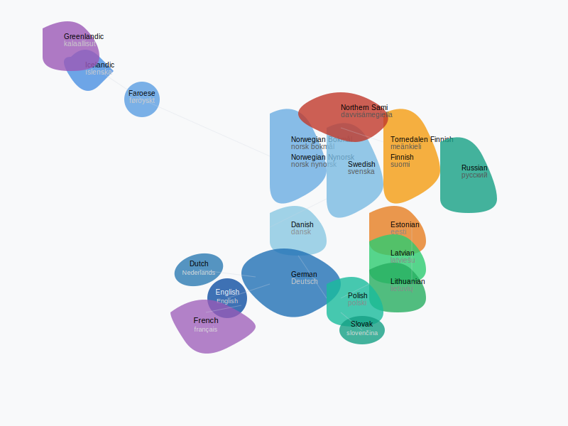

[](https://github.com/jarilammi/lutheran.radio/actions/workflows/codeql-analysis.yml)

# Lutheran Radio

📱 [Available on the App Store](https://apps.apple.com/fi/app/lutheran-radio/id6738301787?l=fi)

Listen to Lutheran Radio on iOS.

## Localizations
<table style="border: none;">
<tr>
<td width="40%" style="border: none;">

The app is fully localized in the following languages:
- Danish (da)
- German (de)
- English (en)
- Estonian (et)
- Finnish (fi)
- Tornedalen Finnish (fit)
- Faroese (fo)
- Icelandic (is)
- Greenlandic (kl)
- Lithuanian (lt)
- Latvian (lv)
- Norwegian Bokmål (nb)
- Norwegian Nynorsk (nn)
- Polish (pl)
- Russian (ru)
- Northern Sami (se)
- Slovak (sk)
- Swedish (sv)

</td>
<td width="60%" style="border: none;">



</td>
</tr>
</table>

## Local Development and Contributing

### AI Coding Instructions

All AI coding agents (Claude, Grok, Cursor, Aider, Windsurf, etc.) **must** follow [`CODING_AGENT.md`](CODING_AGENT.md) as their permanent system prompt / project instructions.

This ensures every single change respects the same non-negotiable security model, localization rules, and build gates.

### Prerequisites
 - Xcode 26+ (Swift 6)
 - iOS 26.4 simulator

To ensure a smooth development experience, follow these steps before contributing:

1. **Verify Project Build:** Confirm the project builds successfully with: ```xcodebuild -scheme "Lutheran Radio" -sdk iphonesimulator26.4 -destination 'platform=iOS Simulator,OS=26.4,name=iPhone 17' clean build```
   Ensure the output includes: **```** BUILD SUCCEEDED **```**

2. **Run Test Suite:** Validate the test suite passes with: ```xcodebuild -scheme "Lutheran Radio" -sdk iphonesimulator26.4 -destination 'platform=iOS Simulator,OS=26.4,name=iPhone 17' clean test```
   Check that the output includes: **```** TEST SUCCEEDED **```**

By verifying these steps on your local machine, you'll help maintain a consistent development environment for the project.

### Troubleshooting

If you encounter build or test issues, try these steps:

1. **Set Xcode Path:** If Xcode commands aren't found, run: ```sudo xcode-select -s /Applications/Xcode.app```
   Verify that your desired iPhone model is available with: ```xcrun simctl list```

2. **Clean Build Folder**: ```xcodebuild clean```

3. **Clean Derived Data**: This removes all derived data for all projects, so use with caution: ```rm -rf ~/Library/Developer/Xcode/DerivedData/*```

After cleaning, retry the build and test steps above.

# Security Implementation

## Certificate Pinning

The app implements certificate pinning to prevent man-in-the-middle (MITM) attacks. Key details:

1. **Domain:** ```lutheran.radio``` (including subdomains)
2. **Pinned Value:** SHA-256 fingerprint of the server’s leaf certificate, hex-encoded (uppercase, colon-separated)
3. **Location:** Embedded in ```Info.plist``` under ```NSAppTransportSecurity > NSPinnedDomains``` (primary) and ```CertificateValidator.swift``` (runtime validation)
4. **Current Fingerprint:** ```CC:F7:8E:09:EF:F3:3D:9A:5D:8B:B0:5C:74:28:0D:F6:BE:14:1C:C4:47:F9:69:C2:90:2C:43:97:66:8B:3D:CC```

### Dual Pinning Methods

For enhanced security, the app uses two complementary pinning approaches:

1. **SPKI Pinning (via Info.plist - Primary ATS Enforcement)**:
   - Pins the SHA-256 fingerprint of the certificate's public key (SPKI) in Base64 format.
   - Enforced by App Transport Security (ATS) for all connections to `lutheran.radio` (including subdomains).
   - Allows certificate rotations without app updates, as long as the public key remains consistent.
   - Current Pinned SPKI Fingerprints (from `Info.plist` under `NSAppTransportSecurity > NSPinnedDomains > lutheran.radio > NSPinnedLeafIdentities`):
     - `fwp4KADDyKqDa3qN5vy6UUJlffXBnjzrei3QTuYofYY=`
     - `XuAdGZ5Hy28pa2OHHMOry/fzpW8XyA5AV5bEDwSX2Ys=`
   - Verification: Use `openssl s_client -connect livestream.lutheran.radio:443 -servername livestream.lutheran.radio < /dev/null | openssl x509 -pubkey -noout | openssl pkey -pubin -outform der | openssl dgst -sha256 -binary | base64` and match against these values.

2. **Full Certificate Fingerprint Pinning (via CertificateValidator.swift - Runtime Validation)**:
   - Pins the SHA-256 fingerprint of the full certificate's DER representation (hex, uppercase, colon-separated).
   - Performed at runtime for stricter validation, with caching (10 minutes) and transition support.
   - Complements SPKI by ensuring exact certificate matches, with fallback to ATS during the transition period.

This dual approach provides defense-in-depth: SPKI handles baseline TLS security and rotations, while full pinning adds runtime enforcement. During the transition period (July 27–August 26, 2026), runtime validation allows pinning mismatches to the known alternate key (trusting ATS/SPKI) to prevent disruptions from certificate updates.

The app also detects potential device time manipulation by comparing the device time with the server's Date header during validation. If a significant discrepancy (beyond 5 minutes) is detected, or if the device is in the transition period but the server is not, transition leniency is disabled. This mitigates risks of exploiting the transition window through time manipulation, ensuring stricter enforcement when anomalies are present.

This check enhances security without additional dependencies, while protecting app users and preserving a seamless streaming experience under normal conditions.

### Certificate Renewal Strategy

To ensure uninterrupted service during SSL certificate renewals, the app includes a strategic transition system:

- **Transition Period:** One month before certificate expiry
- **User Experience:** During the transition period, the app trusts ATS validation if the pinned fingerprint fails, allowing streaming to continue with a debug warning (visible in DEBUG builds)
- **Security Protection:** Transition support is automatically enabled during the defined period, with strict enforcement of the pinned fingerprint outside this window
- **Implementation:** Controlled via `CertificateValidator.swift` with predefined transition start and expiry dates

This approach prevents service disruption during certificate updates while maintaining security through continued ATS enforcement and time-bounded operation.

### Why SHA-256?

- Strong collision resistance
- Fast verification for frequent connections
- Suitable for public key pinning (not sensitive data)

### Verifying the Certificate Fingerprint

To check or update the pinned fingerprint:

```bash
openssl s_client -connect livestream.lutheran.radio:443 -servername livestream.lutheran.radio < /dev/null 2>/dev/null \
| openssl x509 -pubkey -noout \
| openssl pkey -pubin -inform pem -outform der \
| openssl dgst -sha256 -binary \
| base64
```

Match the output against the ```SPKI-SHA256-BASE64``` value in ```Info.plist```. Update if necessary.

## Memory Integrity Enforcement

The app opts into iOS 26's Memory Integrity Enforcement (MIE) features, including the Enhanced Memory Tagging Extension (EMTE), to provide hardware-backed memory safety protections on compatible devices (e.g., iPhone 17 and later with A19 or newer chips). Full support for building and enabling these features requires Xcode 26+. This helps mitigate memory corruption exploits, use-after-free vulnerabilities, and other memory-related security issues by enforcing tagged memory allocations, bounds checking, and pointer authentication at runtime.

This feature enhances the app's defense-in-depth strategy, ensuring robust security for users on the latest iOS devices while maintaining backward compatibility.

The app enables additional MIE options for stricter memory protections:
- `com.apple.security.hardened-process.checked-allocations.enable-pure-data = true`: Enforces pure data allocations to prevent executable code in data regions.
- `com.apple.security.hardened-process.checked-allocations.no-tagged-receive = true`: Disallows receipt of tagged pointers from untrusted sources, preserving tag integrity.

## Security Model Validation

The app performs security model validation to confirm that the version in use matches an approved security implementation before streaming content. This protects against compromised or obsolete app versions.

1. **Primary domain:** `securitymodels.lutheran.radio`
   **Backup domain:** `securitymodels.lutheranradio.sk` (smart fallback)
2. **Mechanism:** Queries DNS TXT records from the ordered list of domains. On success (expected model present), caches result for 1 hour. Permanent failure aborts immediately; transient errors trigger fallback to the backup domain only.
3. **Pinned Value:** Defined in `Core/Configuration/SecurityConfiguration.swift` as `expectedSecurityModel` (currently `"starbase"`)
4. **Location:** Enforced by the actor `Core/Actors/SecurityModelValidator.swift` (single source of truth for validation)
5. **Behavior:** If the app’s security model isn’t in the TXT record, playback is permanently disabled with a user-facing error message

### Why DNS TXT Records?

The app uses a DNS TXT record on `securitymodels.lutheran.radio` for lightweight, dynamic security model validation. This mechanism allows central updating of approved security models without requiring an immediate App Store update for every user.

**DNSSEC Protection**

The `lutheran.radio` zone, including the `securitymodels` subdomain, is protected by **DNSSEC with signed delegation**. The zone is properly signed (visible RRSIG records) and the chain of trust is established from the `.radio` TLD upward.

When queried with the DO (DNSSEC OK) bit set (e.g. `dig +dnssec`), the response includes:
- The TXT record containing the comma-separated list of valid models:
  `"dc,florida,tampa,atlanta,birmingham,houston,starbase"`
- An accompanying **RRSIG** signature.

In the current observed responses, the **AD (Authenticated Data)** flag is **not** set (`;; flags: qr rd ra`), indicating that the recursive resolver did not perform (or did not assert) full DNSSEC validation when answering the query.

**Current Validation Behavior**

The app performs the TXT query via `DNSServiceQueryRecord` **without** the `kDNSServiceFlagsValidate` (or `kDNSServiceFlagsValidateOptional`) flag. Therefore:
- It does **not** perform client-side DNSSEC validation itself.
- It relies on the device’s configured recursive resolver for any DNSSEC checking.
- The mechanism still benefits from the signed zone, making off-path forgery and cache poisoning significantly harder.

Because of these characteristics, the DNS TXT record serves as a useful but not absolute dynamic validation signal. It is supported by certificate pinning on the streaming infrastructure and the app’s failure model: if validation does not succeed, streaming does not proceed until the user installs a version with an updated security model.

This design provides a practical balance between security, simplicity, and resilience (aided by the 1-hour success-only cache).

**Verifying DNSSEC Status**
To check the current TXT record and DNSSEC-related information:

```bash
# Full response with flags and signatures
dig +dnssec TXT securitymodels.lutheran.radio | grep -E "(^securitymodels|flags:|AD:|RRSIG)"

# Short version (TXT + RRSIG)
dig +short +dnssec TXT securitymodels.lutheran.radio
```

Look for the **AD** flag (Authenticated Data) in the `;; flags:` line. Its presence indicates that the resolver performed and accepted DNSSEC validation.

### Verifying the Security Model

To check the current valid security models:

```bash
dig +short +dnssec TXT securitymodels.lutheran.radio
```

Example output:

```
"dc,florida,tampa,atlanta,birmingham,houston,starbase"
TXT 13 3 600 20260328052556 20260326032556 34505 lutheran.radio. CEZx+X3J947EaeiH/hevPZUJvaovpylfY9vLdMb75ohAW3MFuNg9RbnZ 5cjnVglSPo43UCk97UZwkQcREaNY0Q==
```

Compare this output to the security model defined in the app (found in ```DirectStreamingPlayer.swift``` as ```appSecurityModel```). If the app’s model (e.g., "starbase") isn’t listed, it will fail validation. To update the list, modify the TXT record for ```securitymodels.lutheran.radio``` through the DNS management interface for the ```lutheran.radio``` domain.

### Security Model Validation Cache

To improve resilience against transient DNS failures (e.g., network instability or temporary outages), the app implements a 1-hour persistent cache for successful security model validations. This cache is stored securely in `UserDefaults` and only applies to successful checks, ensuring the app can skip redundant DNS queries during short disruptions without compromising security.

#### Key Details:
- **Duration:** 1 hour (3600 seconds) from the last successful validation.
- **Storage:** A non-sensitive timestamp (`Date`) is stored in `UserDefaults` under the key `"lastSecurityValidation"`. No actual security models or TXT records are cached.
- **Behavior:**
  - On app launch or validation trigger: If a valid cache exists (timestamp within 1 hour), the app assumes success and proceeds with streaming.
  - Cache is only updated on successful DNS fetches (i.e., when the embedded `appSecurityModel` matches the TXT record).
  - Failures are **not** cached—full validation (DNS query) is always performed on failure, with permanent disablement if the model is invalid.
  - Time handling uses an injectable `currentDate()` closure for testability and consistency.
- **Security Considerations:**
  - The cache provides a short window during which a previously successful validation remains valid. If the DNS TXT record changes, devices with a recent cache may continue for up to 1 hour. This supports availability in low-connectivity scenarios.
  - Mitigates risks like time manipulation (complements existing device/server time skew detection in certificate validation).
  - No new attack surfaces: `UserDefaults` is app-sandboxed; tampering requires device compromise.

#### Verifying the Cache
For debugging (e.g., in Xcode Console during development):
- Successful cache hit: Logs `"🔒 [Security] Using cached validation (last: [timestamp])"` (DEBUG builds only).
- Cache update: Logs `"🔒 [Security] Cached new successful validation"` on success.

To manually inspect or clear the cache:
- Use `UserDefaults.standard.object(forKey: "lastSecurityValidation") as? Date` in code or via debugger.
- Clear via app deletion/reinstall or `UserDefaults.standard.removeObject(forKey: "lastSecurityValidation")`.

This feature enhances availability while maintaining the app's privacy-first principles, reducing unnecessary network calls.

### Security Isolation Architecture

All security-critical constants (expected model name, certificate fingerprints, transition window dates) are now centralized in `Core/Configuration/SecurityConfiguration.swift`.
The DNS TXT record validation logic has been extracted into a dedicated Swift actor `Core/Actors/SecurityModelValidator.swift`, which enforces strict actor isolation and provides the single entry point `validateSecurityModel()`.

This refactor:
- Improves maintainability and testability
- Enforces Swift 6 concurrency rules
- Keeps identical runtime behavior and security guarantees
- Does **not** change the current model ("starbase"), fingerprints, transition period, or any validation rules

`DirectStreamingPlayer.swift` and `CertificateValidator.swift` now consume these shared components instead of duplicating logic.

### Security Model TXT Record Usage

Lutheran Radio's security system uses a DNS TXT record to ensure only trusted app versions can stream content. The longest practical TXT record length for this purpose is about 450 bytes, which fits within standard DNS limits and supports up to 40-50 security model names (like "landvetter" or "nuuk"). This is more than enough for the current 51-byte record. If you need to use more names in the future, check that your DNS supports larger messages (EDNS0) and test the app to confirm it can handle them. Keep an eye on how your DNS behaves to ensure everything works smoothly, keeping the app secure and reliable for all users.

### Security Model History

To avoid naming collisions, each security model name should be unique and not match any previously used name. This helps prevent unintended compatibility with older app versions.

| Security Model Name | Valid From         | Valid Until        | App Version Introduced |
|---------------------|--------------------|--------------------|------------------------|
| `turku`             | April 8, 2025      | April 20, 2025     | 1.0.4                  |
| `mariehamn`         | April 15, 2025     | July 26, 2025      | 1.0.7                  |
| `visby`             | May 26, 2025       | July 26, 2025      | 1.1.1                  |
| `landvetter`        | June 1, 2025       | July 26, 2025      | 1.1.2                  |
| `nuuk`              | June 15, 2025      | July 26, 2025      | 1.2.1                  |
| `stjohns`           | July 22, 2025      | August 20, 2025    | 1.2.3                  |
| `dc`                | July 27, 2025      | (ongoing)          | 1.2.4                  |
| `florida`           | August 24, 2025    | (ongoing)          | 1.2.7                  |
| `tampa`             | August 31, 2025    | (ongoing)          | 1.2.8                  |
| `atlanta`           | October 6, 2025    | (ongoing)          | 26.0.1                 |
| `birmingham`        | November 9, 2025   | (ongoing)          | 26.0.2                 |
| `houston`           | March 3, 2026      | (ongoing)          | 26.3.0                 |
| `starbase`          | (pending)          | (pending)          | (pending)              |

**Notes:**
- **Valid From:** The date when the security model was first published to the App Store.
- **Valid Until:** The date when the security model was deprecated (or "(ongoing)" if still active).
- **App Version Introduced:** The app version where this security model was first implemented.
- **Valid From Dates:** Reflect the App Store publication date for the app version introducing the security model, ensuring alignment with public availability.
- When adding a new security model, append a new row to this table and update the DNS TXT record accordingly (see "Verifying the Security Model" above).

When introducing a new security model:

1. Choose a unique name not listed in the table (e.g., a distinct city or codename).
2. Update `expectedSecurityModel` in `Core/Configuration/SecurityConfiguration.swift`.
3. Add the new name to the DNS TXT record for `securitymodels.lutheran.radio`.
4. Append a new row to the table above with the current date, app version, and name.

### Why Track Security Model Names?

Security model names (e.g., ```starbase```) are embedded in the app and validated against the DNS TXT record. Once a name is used, it becomes part of the app's history and may still exist in older versions. Reusing a name could allow an older version to pass validation in some cases. By maintaining this table, we ensure that:

- New security model names are unique and avoid collisions with past names.
- The history of security models is transparent for debugging and auditing.
- Contributors can easily pick a fresh name (e.g., a unique city, codename, or identifier) when implementing a new security model.
