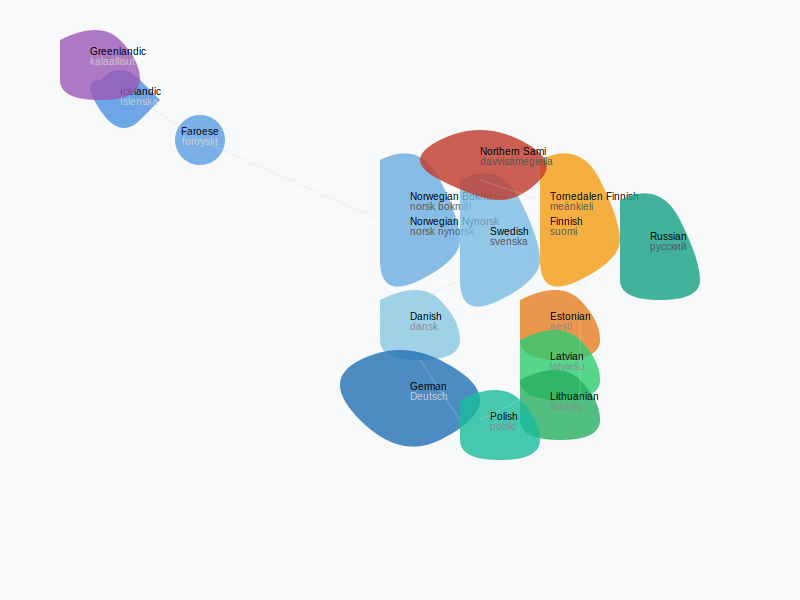

[](https://github.com/jarilammi/lutheran.radio/actions/workflows/codeql-analysis.yml)

# Lutheran Radio

📱 [Available on the App Store](https://apps.apple.com/fi/app/lutheran-radio/id6738301787?l=fi)

Listen to Lutheran Radio on iOS.

## Localizations
<table style="border: none;">
<tr>
<td width="40%" style="border: none;">

The app is fully localized in the following languages:
- Danish (da)
- German (de)
- English (en)
- Estonian (et)
- Finnish (fi)
- Tornedalen Finnish (fit)
- Faroese (fo)
- Icelandic (is)
- Greenlandic (kl)
- Lithuanian (lt)
- Latvian (lv)
- Norwegian Bokmål (nb)
- Norwegian Nynorsk (nn)
- Polish (pl)
- Russian (ru)
- Northern Sami (se)
- Swedish (sv)

</td>
<td width="60%" style="border: none;">



</td>
</tr>
</table>

## Local Development and Contributing

To ensure a smooth development experience, follow these steps before contributing:

1. **Verify Project Build:** Confirm the project builds successfully with: ```xcodebuild -scheme "Lutheran Radio" -sdk iphonesimulator18.4 -destination 'platform=iOS Simulator,OS=18.4,name=iPhone 16 Pro' clean build```
   Ensure the output includes: **```** BUILD SUCCEEDED **```**

2. **Run Test Suite:** Validate the test suite passes with: ```xcodebuild -scheme "Lutheran Radio" -sdk iphonesimulator18.4 -destination 'platform=iOS Simulator,OS=18.4,name=iPhone 16 Pro' clean test```
   Check that the output includes: **```** TEST SUCCEEDED **```**

By verifying these steps on your local machine, you'll help maintain a consistent development environment for the project.

### Troubleshooting

If you encounter build or test issues, try these steps:

1. **Set Xcode Path:** If Xcode commands aren't found, run: ```sudo xcode-select -s /Applications/Xcode.app```
   Verify that your desired iPhone model is available with: ```xcrun simctl list```

2. **Clean Build Folder**: ```xcodebuild clean```

3. **Clean Derived Data**: This removes all derived data for all projects, so use with caution: ```rm -rf ~/Library/Developer/Xcode/DerivedData/*```

After cleaning, retry the build and test steps above.

# Security Implementation

## Certificate Pinning

The app implements certificate pinning to prevent man-in-the-middle (MITM) attacks. Key details:

1. **Domain:** ```lutheran.radio``` (including subdomains)
2. **Pinned Value:** SHA-256 hash of the server’s public key, Base64-encoded
3. **Location:** Embedded in ```Info.plist``` under ```NSAppTransportSecurity > NSPinnedDomains```
4. **Current Hash:** ```mm31qgyBr2aXX8NzxmX/OeKzrUeOtxim4foWmxL4TZY=```

### Why SHA-256?

- Strong collision resistance
- Fast verification for frequent connections
- Suitable for public key pinning (not sensitive data)

### Verifying the Certificate Hash

To check or update the pinned hash:

```bash
openssl s_client -connect livestream.lutheran.radio:8443 -servername livestream.lutheran.radio < /dev/null 2>/dev/null \
| openssl x509 -pubkey -noout \
| openssl pkey -pubin -inform pem -outform der \
| openssl dgst -sha256 -binary \
| base64
```

Match the output against the ```SPKI-SHA256-BASE64``` value in ```Info.plist```. Update if necessary.

## Security Model Validation

The app enforces security model validation to ensure only versions with an approved security implementation can stream content. This protects against compromised or obsolete app versions.

1. **Domain:** ```securitymodels.lutheran.radio```
2. **Mechanism:** Queries a DNS TXT record for a comma-separated list of valid security models (e.g., `"korppoo,turku"`)
3. **Pinned Value:** Fixed security model string embedded in the app (currently `"turku"`)
4. **Location:** Defined in `DirectStreamingPlayer.swift` as `appSecurityModel`
5. **Behavior:** If the app’s security model isn’t in the TXT record, playback is permanently disabled with a user-facing error message

### Why DNS TXT Records?

- **Dynamic Updates:** Allows real-time revocation of compromised models without app updates
- **Simplicity:** Leverages existing DNS infrastructure for lightweight validation
- **Security:** Complements certificate pinning by tying app functionality to server-defined policies

### Verifying the Security Model

To check the current valid security models:

```bash
dig +short TXT securitymodels.lutheran.radio
```

Example output:

```
"korppoo,turku"
```

Compare this against the appSecurityModel value in DirectStreamingPlayer.swift. If the app’s model (e.g., "turku") isn’t listed, it will fail validation. To update the list, modify the TXT record on the securitymodels.lutheran.radio DNS server.
